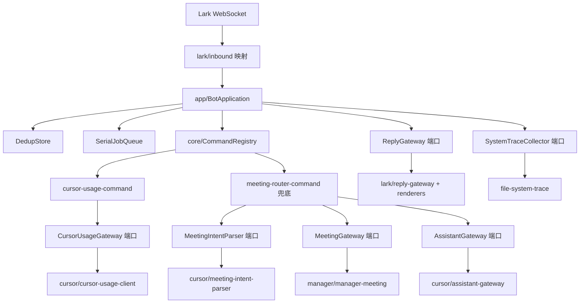

## 架构清理重构

### 目标
把当前"新旧分层并存"的代码统一为干净的模块化单体 + 端口适配器结构，消除根目录散落文件、双套创建会议实现、上帝工厂 `createLarkMessageProcessor` 与各处死代码；生成最新结构图与文档。生产行为与 [usage.md](usage.md) 承诺的命令一律不变。

### 先决：新建分支
从干净的 `main` 切出 `refactor/architecture-cleanup`。

### 目标目录结构
```text
src/
  index.ts                       # 极简入口：loadConfig() + startBot()
  bootstrap/
    config.ts                    # 环境变量加载与校验（来自 src/config.ts）
    default-config.ts            # 非敏感默认值（来自 src/default-config.ts）
    composition-root.ts          # 唯一装配点（合并 lark-bot.ts + lark-message-processor.ts）
  app/
    bot-application.ts           # 编排：去重/队列/reaction/trace/回复
    serial-job-queue.ts
    in-memory-dedup-store.ts
  core/
    types.ts  command-registry.ts  reactions.ts  assistant-prompt.ts
    meeting.ts  cursor-usage.ts
    system-trace.ts              # 从 src/system-trace.ts 迁入
    commands/
      meeting-router-command.ts  # 由 create-meeting-router-command.ts 重命名
      cursor-usage-command.ts  cursor-usage-parser.ts
  ports/
    reply.ts  assistant.ts  meeting.ts  cursor-usage.ts
    runtime.ts                   # 仅 Logger/DedupStore/JobQueue
    reaction.ts  trace.ts        # 从 runtime.ts 拆出
  adapters/
    lark/
      protocol.ts                # Lark 事件类型 + 内容/表情序列化（来自 message.ts）
      inbound.ts                 # event -> MessageInput
      gateways.ts                # Lark.Client -> reaction/消息/卡片底层操作（从 lark-bot.ts 抽出）
      reply-gateway.ts  renderers.ts
    cursor/
      cursor-agent.ts            # SDK 加载 + streamCursorReply
      assistant-gateway.ts       # 新增：实现 AssistantGateway
      meeting-intent-parser.ts   # 由 create-meeting-intent-parser.ts 迁入（含归一化助手）
      cursor-usage-client.ts     # 由 cursor-usage.ts 迁入
    manager/
      manager-meeting.ts         # 真实实现（从 src/manager-meeting.ts 迁入）+ createManagerMeetingGateway
    file-system-trace.ts
  shared/
    timing.ts                    # 从 src/timing.ts 迁入
```

### 数据流（目标）

依赖方向单向收敛：`adapters -> ports -> core`、`app -> core/ports`、`bootstrap -> 全部`；`core` 不依赖任何 adapter。

### 文件迁移（移动/重命名）
- [src/config.ts](src/config.ts) -> `src/bootstrap/config.ts`；[src/default-config.ts](src/default-config.ts) -> `src/bootstrap/default-config.ts`。
- [src/system-trace.ts](src/system-trace.ts) -> `src/core/system-trace.ts`；[src/timing.ts](src/timing.ts) -> `src/shared/timing.ts`。
- [src/manager-meeting.ts](src/manager-meeting.ts) -> `src/adapters/manager/manager-meeting.ts`（删除 `index.ts` 的 `export *` 转发，新增 `createManagerMeetingGateway` 返回 `MeetingGateway`，并让 `ManagerCloudPlayerOptions` 复用 core 的 `CloudPlayerCommandOptions`）。
- [src/message.ts](src/message.ts) 拆分：协议类型 + `toLarkTextContent/toLarkCardReferenceContent/toLarkReactionPayload` -> `src/adapters/lark/protocol.ts`；`extractIncomingText` 合并进 [src/adapters/lark/inbound.ts](src/adapters/lark/inbound.ts)。
- [src/adapters/cursor/cursor-usage.ts](src/adapters/cursor/cursor-usage.ts) -> `src/adapters/cursor/cursor-usage-client.ts`（自带 `CursorUsageClientConfig`，不再 import bootstrap 的 config）。
- [src/adapters/cursor/create-meeting-intent-parser.ts](src/adapters/cursor/create-meeting-intent-parser.ts) -> `src/adapters/cursor/meeting-intent-parser.ts`，并把 `normalizeMeetingParameters`/`parseCursorJson` 从 parameter-parser 内联进来。
- [src/core/commands/create-meeting-router-command.ts](src/core/commands/create-meeting-router-command.ts) -> `src/core/commands/meeting-router-command.ts`。
- [src/ports/runtime.ts](src/ports/runtime.ts) 拆出 `ReactionGateway` -> `ports/reaction.ts`、`SystemTraceCollector` -> `ports/trace.ts`（import 改指 `core/system-trace.ts`）。

### 删除（遗留/未注册/死代码）
- [src/lark-bot.ts](src/lark-bot.ts)、[src/lark-message-processor.ts](src/lark-message-processor.ts)（职责并入 `bootstrap/composition-root.ts`）。
- [src/core/commands/create-meeting-command.ts](src/core/commands/create-meeting-command.ts)、[src/core/commands/create-meeting-parser.ts](src/core/commands/create-meeting-parser.ts)、[src/core/commands/assistant-command.ts](src/core/commands/assistant-command.ts)。
- [src/adapters/cursor/create-meeting-parameter-parser.ts](src/adapters/cursor/create-meeting-parameter-parser.ts)（仅保留的归一化函数已内联到 intent-parser）。
- [src/adapters/manager/index.ts](src/adapters/manager/index.ts) 转发 hack。
- 死导出：`message.ts` 的 `toLarkCardContent`、`timing.ts` 的 `formatDurationMs`、`ports/meeting.ts` 中仅服务旧路径的 `MeetingParameterParser`/`ParsedMeetingParameters`（确认无引用后删）。

### 组合根（composition-root.ts）
装配顺序：构建 `Lark.Client`/`WSClient` -> `lark/gateways` 产出 reaction 与消息/卡片底层操作 -> `createLarkReplyGateway` -> `createCursorAssistantGateway` -> `createCursorMeetingIntentParser` -> `createManagerMeetingGateway` -> `createCursorUsageClient` -> `createFileSystemTraceCollector` -> `createCommandRegistry([cursorUsageCommand], meetingRouterCommand)` -> `createBotApplication({...})` -> 注册 `im.message.receive_v1`：`mapLarkIncomingMessage(event)` 命中则 `app.handleMessage`（保留收到消息日志）-> `wsClient.start`。[src/index.ts](src/index.ts) 改为 `startBot(loadConfig())`。

### 测试重组（test/）
- 删除：`command-handlers.test.ts` 中 `createMeetingCommandHandler`/`createAssistantCommandHandler` 用例、`create-meeting-parameter-parser.test.ts`、`message.test.ts` 中 `parseCreateMeetingCommand` 用例、`timing.test.ts` 中 `formatDurationMs` 用例。
- 重写：`lark-message-processor.test.ts`（基于 god factory）-> 拆分为 `bot-application.test.ts`（去重/队列/reaction/trace 路径）与 `lark-adapter.test.ts`（卡片/文本流式回复）应覆盖的场景；新增 `composition-root` 的轻量装配 smoke（可选）。
- 更新全部测试 import 路径到新文件位置；`message.test.ts` 中协议/抽取用例迁至针对 `adapters/lark/protocol.ts` 与 `inbound.ts`。
- `config.test.ts`/`manager-meeting.test.ts`/`cursor-usage.test.ts`/`create-meeting-intent-parser.test.ts`/`file-system-trace.test.ts`/`cursor-agent.test.ts`/`command-registry.test.ts` 仅改 import 路径。

### 文档产出
- 新建 `docs/ARCHITECTURE.md`：含上面的 mermaid 结构图与一张分层依赖图、各层职责、消息处理时序、"如何新增一个命令/适配器"的扩展指南。
- 更新 [readme.md](readme.md) 与 [AGENTS.md](AGENTS.md) 的架构小节，指向新目录与 `docs/ARCHITECTURE.md`，更新 `src/app|core|ports|adapters|bootstrap|shared` 边界描述。

### 构建与校验
- `tsconfig.json`/`tsconfig.build.json`（include `src/**`、entry `src/index.ts`）无需改；所有相对 import 维持 `.ts` 后缀。
- 依次通过：`pnpm typecheck`、`pnpm test`、`pnpm build`、`pnpm format:check`（提交前先 `pnpm format`）。

### 非目标
不引入数据库/队列/HTTP 服务/多进程；不改用户可见命令文案与回复语义；不扩展运营后台为多环境。
