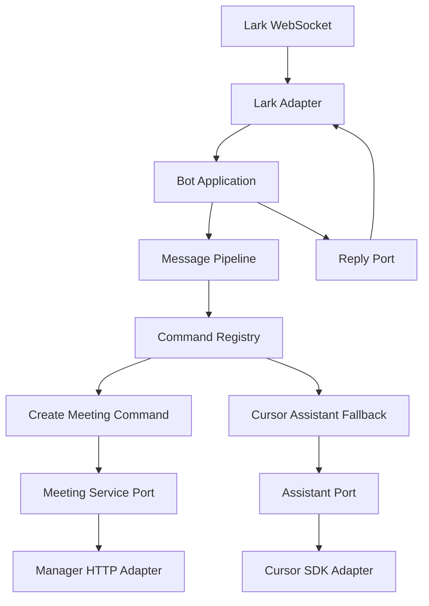

# 可扩展机器人框架架构设计

## 当前判断

现有项目入口很轻量：[src/index.ts](/Users/zreal/code/private/lark-cli/src/index.ts) 只负责加载配置并启动机器人；[src/lark-bot.ts](/Users/zreal/code/private/lark-cli/src/lark-bot.ts) 同时装配 Lark Client、WebSocket、Lark消息发送、卡片更新和会议客户端；[src/lark-message-processor.ts](/Users/zreal/code/private/lark-cli/src/lark-message-processor.ts) 承担了事件过滤、去重、串行队列、reaction、命令分流、Cursor 流式回复和Lark输出；[src/message.ts](/Users/zreal/code/private/lark-cli/src/message.ts) 混合了Lark协议类型、命令解析、Prompt、卡片构建和会议回复；[src/manager-meeting.ts](/Users/zreal/code/private/lark-cli/src/manager-meeting.ts) 混合了登录、token 缓存、HTTP 调用、会议 payload、云播 payload 和响应解析。

这说明重构重点不是“拆文件”，而是先建立稳定边界：输入事件、命令、应用用例、输出渲染、外部系统适配器、运行时编排。

## 可选方案

推荐方案：模块化单体 + 端口适配器 + 命令插件。

该方案保留 `pnpm dev` / `pnpm start` 的单进程运行方式，不引入数据库、队列或 HTTP 服务；内部改为可扩展机器人框架。核心业务只依赖端口接口，Lark、Cursor SDK、运营后台 HTTP 都放到 adapter 层。新增能力时优先新增 `CommandHandler` 或 `AssistantProvider`，而不是继续改大文件。

备选方案一：按现有文件做功能拆分。

优点是迁移快、风险低；缺点是仍容易形成“更小的大泥球”，命令、Lark协议和外部调用边界不够清晰，后续新增命令仍会改动中心处理器。

备选方案二：生产级机器人平台。

直接设计数据库、任务队列、观测、权限、多租户和部署拓扑。优点是扩展上限高；缺点是与你确认的“无外部基础设施、保持单进程部署”不匹配，当前规模会引入过多运维和概念成本。

## 目标架构



建议目录边界：

- `src/bootstrap/`：进程入口、配置加载、依赖装配。迁移 [src/index.ts](/Users/zreal/code/private/lark-cli/src/index.ts)、[src/config.ts](/Users/zreal/code/private/lark-cli/src/config.ts)、[src/default-config.ts](/Users/zreal/code/private/lark-cli/src/default-config.ts) 的职责。
- `src/app/`：机器人应用编排，如 `BotApplication`、消息管线、串行任务队列、去重策略、错误处理策略。
- `src/core/`：不依赖Lark/Lark/Cursor SDK 的核心模型和用例，包括 `IncomingMessage`、`BotReply`、`CommandHandler`、`CommandRegistry`、会议创建命令、Cursor fallback 命令。
- `src/ports/`：接口定义，如 `MessageGateway`、`ReplyGateway`、`AssistantGateway`、`MeetingGateway`、`Logger`、`Clock`、`JobQueue`。
- `src/adapters/lark/`：Lark WebSocket 事件映射、消息发送、reaction、卡片 streaming、Lark card renderer。
- `src/adapters/cursor/`：Cursor SDK agent 创建、流式输出、ripgrep path 处理。迁移 [src/cursor-agent.ts](/Users/zreal/code/private/lark-cli/src/cursor-agent.ts)。
- `src/adapters/manager/`：运营后台 HTTP、token 管理、会议 payload、云播 payload、响应解析。迁移 [src/manager-meeting.ts](/Users/zreal/code/private/lark-cli/src/manager-meeting.ts)。
- `src/shared/`：通用时间、结果类型、错误类型等无业务依赖工具。迁移 [src/timing.ts](/Users/zreal/code/private/lark-cli/src/timing.ts)。

核心接口形态：

```ts
export type CommandHandler = {
    name: string;
    match(input: MessageInput): CommandMatch | null;
    execute(context: CommandContext, match: CommandMatch): Promise<BotReply | ReplyStream>;
};
```

命令层只返回框架内的 `BotReply` / `ReplyStream`，不直接调用Lark SDK。Lark卡片、文本消息、reaction 和 streaming update 由 `ReplyGateway` 与 Lark adapter 负责。

## 关键设计决策

第一阶段保持单进程和内存状态：当前 `seenMessageIds`、串行 `queue`、token cache 都可以保留为内存实现，但它们要从业务处理器里抽到 `DedupStore`、`JobQueue`、`TokenStore` 这类接口背后。这样不引入外部基础设施，也不阻断未来替换。

命令使用注册机制：`创建会议` 不再硬编码在通用消息处理器中，而是一个 `CreateMeetingCommandHandler`。Cursor 回复作为 fallback handler 存在。后续新增命令时只需注册 handler，并补充对应测试。

输出渲染分层：核心层表达“会议创建成功”“助手回复流”等语义，Lark adapter 决定用 text、interactive card 还是 streaming card 发出。当前 [src/message.ts](/Users/zreal/code/private/lark-cli/src/message.ts) 里的卡片构建应迁移到 `src/adapters/lark/renderers/`。

运营后台拆为领域服务和 HTTP adapter：会议 payload 中大量测试默认值应集中到配置/模板模块，登录与 token 刷新留在 manager adapter，命令 handler 只关心 `MeetingGateway.createMeeting()`。

## 迁移顺序

1. 建立 `core` / `ports` 基础类型，并用现有测试锁住行为：文本提取、mention 清理、命令解析、Cursor prompt、会议回复格式。
2. 抽出命令注册和消息管线，让当前 `createLarkMessageProcessor` 变薄，先通过 adapter 调用新 `BotApplication`。
3. 将 Cursor fallback 改成 `AssistantCommandHandler`，将 `streamCursorReply` 封装到 `AssistantGateway`。
4. 将创建会议改成 `CreateMeetingCommandHandler`，将命令解析、会议执行、回复语义从 [src/message.ts](/Users/zreal/code/private/lark-cli/src/message.ts) 和 [src/lark-message-processor.ts](/Users/zreal/code/private/lark-cli/src/lark-message-processor.ts) 中移出。
5. 将Lark输出能力拆成 `LarkReplyGateway`，把 card renderer 和 streaming update 从消息处理器里移出。
6. 将运营后台拆分为 token client、meeting payload builder、cloud player client、meeting gateway，保留现有 HTTP 行为与 token 刷新语义。
7. 调整 bootstrap composition root，让 [src/lark-bot.ts](/Users/zreal/code/private/lark-cli/src/lark-bot.ts) 只负责依赖装配和启动 WebSocket。
8. 更新 [readme.md](/Users/zreal/code/private/lark-cli/readme.md) 和 [AGENTS.md](/Users/zreal/code/private/lark-cli/AGENTS.md) 的架构说明、命令扩展方式和验证流程。

## 测试与验证

现有测试可以作为回归基础：[test/lark-message-processor.test.ts](/Users/zreal/code/private/lark-cli/test/lark-message-processor.test.ts)、[test/message.test.ts](/Users/zreal/code/private/lark-cli/test/message.test.ts)、[test/manager-meeting.test.ts](/Users/zreal/code/private/lark-cli/test/manager-meeting.test.ts) 覆盖了最关键行为。重构时应新增 `CommandRegistry`、`BotApplication`、Lark event mapper、Lark reply gateway、Manager adapter 分层测试。

每个阶段验证：

- `pnpm test`
- `pnpm typecheck`
- `pnpm build`
- `pnpm format:check`

## 非目标

第一阶段不引入数据库、外部消息队列、独立 HTTP 服务、Docker 或多进程部署。不改变用户可见命令文案，不改变Lark消息回复语义，不把运营后台测试环境默认值扩展为多环境配置，除非后续另行确认。
