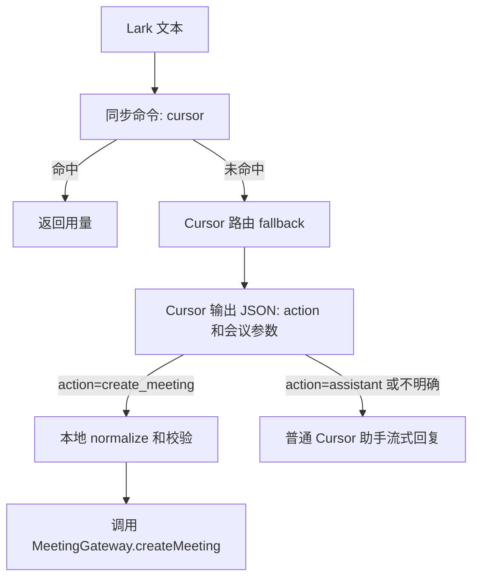

# Cursor 会议意图路由计划

## 目标
把当前“固定 `创建会议` 前缀命中”的会议触发方式，改为“所有非管理命令文本先由 Cursor 做意图判断”。当 Cursor 明确返回 `create_meeting` 时创建会议；返回 `assistant` 或信息不明确时，不创建会议，继续用普通助手回复或澄清。

## 当前约束
现有会议 handler 的触发点在同步 `match()` 中，只能用正则判断：

```18:20:E:\opensource\feishu-cli\src\core\commands\create-meeting-command.ts
const command = parseCreateMeetingCommand(input.text);
return command ? { commandName: 'create-meeting', data: command } : null;
```

而 `CommandRegistry.resolve()` 也是同步的，所以不建议把模型调用塞进现有 `match()`；应把模型判断放到某个总是命中的 fallback handler 的 `execute()` 阶段。

## 推荐方案
新增一个“Cursor 路由 fallback handler”，替代当前普通 assistant fallback 作为最后兜底：



设计取舍：
- 推荐：新增 router fallback，保留 `CommandRegistry` 同步接口，改动集中、风险较低。
- 不推荐：把 `CommandRegistry.resolve()` 改成异步，改动会扩散到 `BotApplication`、trace、测试和所有命令。
- 不推荐：只扩展 `parseCreateMeetingCommand()` 关键词正则，仍然是固定格式/关键词匹配，不能满足“交给 Cursor 判断”。

## 主要改动
1. 在 [src/ports/meeting.ts](E:/opensource/feishu-cli/src/ports/meeting.ts) 增加模型意图解析端口，例如 `MeetingIntentParser`，返回 `action: 'create_meeting' | 'assistant'` 以及会议参数。
2. 在 [src/adapters/cursor/](E:/opensource/feishu-cli/src/adapters/cursor/) 新增会议意图解析器，例如 `create-meeting-intent-parser.ts`：
   - prompt 要求只输出 JSON，不输出 Markdown。
   - schema 包含 `action`、`title`、`startTime`、`eventWays`、`length`、`eventMode`、`permission`、`cloudPlayer`。
   - 本地 normalize 严格校验枚举、时间、时长和云播 URL；模型无法明确判断时返回 `assistant`。
3. 在 [src/core/commands/](E:/opensource/feishu-cli/src/core/commands/) 新增 `create-meeting-router-command.ts`：
   - `match()` 永远返回 fallback match。
   - `execute()` 先调用 `MeetingIntentParser.parse()`。
   - `action=create_meeting` 时构造 `CreateMeetingRequest` 并调用 `MeetingGateway.createMeeting()`。
   - `action=assistant`、解析失败或信息不明确时，走普通 `AssistantGateway.streamReply()`，不调用创建会议。
4. 调整 [src/lark-message-processor.ts](E:/opensource/feishu-cli/src/lark-message-processor.ts)：
   - 保留 `createCursorUsageCommandHandler` 这类明确管理命令在 handlers 数组中。
   - 将 fallback 从 `createAssistantCommandHandler(...)` 改为新的会议路由 fallback。
   - 不再把 `createMeetingCommandHandler` 放在普通消息路由前面，确保 `创建会议 ...` 也先经过 Cursor 判断。
5. 调整 [src/lark-bot.ts](E:/opensource/feishu-cli/src/lark-bot.ts)：
   - 生产启动时注入新的 `createCursorMeetingIntentParser({ apiKey, model })`。
   - 继续保留普通 `streamCursorReply` 作为非会议回复路径。
6. 同步 [usage.md](E:/opensource/feishu-cli/usage.md)：
   - 从“必须以 `创建会议` 开头”改为“可以自然语言描述创建会议需求”。
   - 保留 `创建会议 ...` 作为推荐明确写法。
   - 说明普通聊天不会创建会议；信息不明确时机器人会按普通助手方式回复或澄清。

## 测试计划
按 TDD 执行，先补失败测试再改实现：
- [test/create-meeting-parameter-parser.test.ts](E:/opensource/feishu-cli/test/create-meeting-parameter-parser.test.ts) 或新增 `test/create-meeting-intent-parser.test.ts`：覆盖 `action=create_meeting`、`action=assistant`、非法 JSON、非法枚举、云播解析。
- [test/command-handlers.test.ts](E:/opensource/feishu-cli/test/command-handlers.test.ts)：覆盖 router handler 在会议意图时调用 `createMeeting`，非会议时返回 assistant stream，解析器抛错时不创建会议。
- [test/lark-message-processor.test.ts](E:/opensource/feishu-cli/test/lark-message-processor.test.ts)：覆盖“帮我明天10点开个视频路演”能创建会议；“你好”只走普通助手；“可能要不要开个会”不创建会议。
- 保留旧用例：`创建会议 AI策略会` 仍能创建，只是路径改为 Cursor 意图解析。

验证命令：
- `pnpm exec tsx --test test/create-meeting-intent-parser.test.ts test/command-handlers.test.ts test/lark-message-processor.test.ts`
- `pnpm test`
- `pnpm typecheck`
- `pnpm format:check`

## 风险控制
- 模型只有明确返回 `create_meeting` 才创建会议；模糊场景一律回到 assistant，避免误创建。
- 所有模型输出都经过本地校验和枚举映射，不能直接进入后台 payload。
- 非会议消息会多一次 Cursor 意图判断调用，成本和延迟会上升；这是“所有普通文本先让 Cursor 判断”的必然代价。
