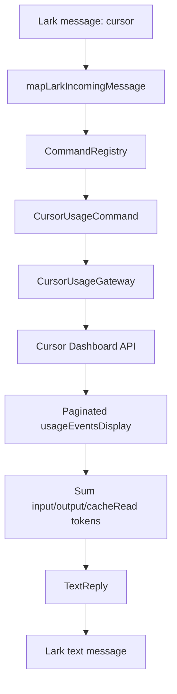

# Cursor Token Usage Command Plan

## 设计结论

实现推荐采用“命令层 + 端口 + Cursor usage HTTP adapter”的小型分层：

- 命令入口：新增 `cursor` 命令。`cursor` 默认查最近 30 天；`cursor 2026-05-06 2026-06-04` 查询指定闭区间日期。
- 配置入口：在 [src/config.ts](src/config.ts) 读取 `CURSOR_USAGE_COOKIE`、`CURSOR_USAGE_TEAM_ID`、`CURSOR_USAGE_USER_ID`，可选 `CURSOR_USAGE_PAGE_SIZE`，并在 [.env.example](.env.example) 只写占位说明。
- API adapter：新增 [src/adapters/cursor/cursor-usage.ts](src/adapters/cursor/cursor-usage.ts)，封装 `POST https://cursor.com/api/dashboard/get-filtered-usage-events`、分页、响应校验和 token 汇总。
- 命令实现：新增 [src/core/commands/cursor-usage-command.ts](src/core/commands/cursor-usage-command.ts) 和 parser，命令只依赖 [src/ports/cursor-usage.ts](src/ports/cursor-usage.ts)，返回已有 `text` 类型回复。
- 组合注册：在 [src/lark-message-processor.ts](src/lark-message-processor.ts) 把 usage 命令注册在 `createAssistantCommandHandler` fallback 之前；在 [src/lark-bot.ts](src/lark-bot.ts) 创建 adapter 并注入。

## 方案取舍

- 推荐方案：专门 adapter + port。优点是符合现有会议命令模式，HTTP 逻辑可 mock 测试，命令层保持简单。
- 备选方案：直接在命令 handler 里 fetch。代码少一点，但会把认证、分页、格式化都塞进 core，后续维护和测试更差。
- 备选方案：新增卡片回复。展示更好看，但需要扩展 `BotReply` 和 Lark renderer；当前需求只是汇总数字，用文本回复更稳。

## 数据流

## 实现步骤

1. 新增领域类型与格式化函数
    - 在 [src/core/cursor-usage.ts](src/core/cursor-usage.ts) 定义 `CursorUsageQuery`、`CursorTokenUsageSummary`。
    - 汇总字段只包含 `inputTokens`、`outputTokens`、`cacheReadTokens`，不累加 `totalCents`。
    - 格式化为易读文本，例如：
        - `Cursor Token 用量`
        - `时间范围：2026-05-06 至 2026-06-04`
        - `记录数：123`
        - `输入 Tokens：12,345`
        - `输出 Tokens：678`
        - `缓存读取 Tokens：90,123`
        - `合计 Tokens：103,146`

2. 新增命令解析与 handler
    - 在 [src/core/commands/cursor-usage-parser.ts](src/core/commands/cursor-usage-parser.ts) 支持：
        - `cursor`
        - `cursor 2026-05-06 2026-06-04`
    - 默认日期为最近 30 天：以当前本地日期结束，开始日期为结束日前 29 天。
    - 日期无效或开始日期晚于结束日期时，handler 返回 `text` 错误提示，不走 Cursor fallback。
    - 在 [src/core/commands/cursor-usage-command.ts](src/core/commands/cursor-usage-command.ts) 调用 `CursorUsageGateway.getUsageSummary()` 并返回文本回复。

3. 新增 Cursor usage port 与 HTTP adapter
    - 在 [src/ports/cursor-usage.ts](src/ports/cursor-usage.ts) 定义 gateway 接口。
    - 在 [src/adapters/cursor/cursor-usage.ts](src/adapters/cursor/cursor-usage.ts) 实现：
        - `createCursorUsageClient(config, fetchImpl = fetch)`。
        - 请求 body 使用 `teamId`、`userId`、`startDate`、`endDate`、`page`、`pageSize`。
        - `startDate` 转为当天 `00:00:00.000` 毫秒字符串，`endDate` 转为当天 `23:59:59.999` 毫秒字符串。
        - 根据 `totalUsageEventsCount > page * pageSize` 继续翻页，直到取完所有 `usageEventsDisplay`。
        - API 非 2xx、JSON 结构异常、缺少 Cookie 配置时抛出中文错误，命令层转成用户可读提示。

4. 接入配置和启动注入
    - 在 [src/config.ts](src/config.ts) 增加 `cursorUsage` 配置块。
    - `CURSOR_USAGE_COOKIE`、`CURSOR_USAGE_TEAM_ID`、`CURSOR_USAGE_USER_ID` 建议启动必填；如果希望不配置也能启动，则 adapter 调用时再报错。计划采用“启动必填”，避免命令运行到一半才发现配置缺失。
    - 在 [.env.example](.env.example) 增加占位，不写真实 Cookie。
    - 在 [src/lark-bot.ts](src/lark-bot.ts) 创建 `createCursorUsageClient(options.cursorUsage)` 并传给 processor。
    - 在 [src/lark-message-processor.ts](src/lark-message-processor.ts) 注册 usage command，位置在会议命令之后、assistant fallback 之前。

5. 补测试
    - 在 [test/command-handlers.test.ts](test/command-handlers.test.ts) 覆盖 `cursor`、显式日期、非法日期、gateway 失败。
    - 新增 [test/cursor-usage.test.ts](test/cursor-usage.test.ts) 用注入的 `fetchImpl` 模拟：
        - 单页汇总。
        - `totalUsageEventsCount` 大于 `pageSize` 时多页请求。
        - 不累加 `totalCents`。
        - 请求 body 的时间毫秒字符串正确。
        - API 错误响应会抛出可读错误。
    - 更新 [test/config.test.ts](test/config.test.ts) 验证 env 读取和数字解析。
    - 更新 [test/lark-message-processor.test.ts](test/lark-message-processor.test.ts) 验证 usage 命令不会调用 Cursor assistant fallback。

6. 验证
    - 运行 `pnpm test`。
    - 运行 `pnpm typecheck`。
    - 如需要格式检查，运行 `pnpm prettier --check .`；当前脚本 `pnpm prettier` 会写回文件，执行前需确认。

## 安全注意

- 不会把这次消息里的 Cookie 写进代码、测试或示例文件。
- 因为 Cookie 已经出现在聊天内容里，建议你后续在 Cursor 网页端刷新/重新登录，并把新的 Cookie 放到本地 `.env` 的 `CURSOR_USAGE_COOKIE`。
