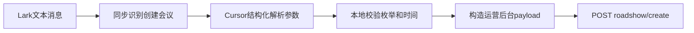

# 创建会议参数解析计划

## 目标

支持用户用不限定格式发送创建会议命令，例如 `创建会议 明天10点开视频路演，主题是AI策略会，权限专场活动，时长60分钟，直播类型上麦直播`。命令仍由本地同步匹配 `创建会议`，但在执行阶段调用 Cursor 把自然语言解析成结构化字段，然后由本地代码校验并映射为后台 payload。

## 设计

核心流程如下：



采用这个方案是因为当前 [src/core/types.ts](src/core/types.ts) 的 `CommandHandler.match` 是同步方法，不能在匹配阶段等待 Cursor；执行阶段已经支持异步，适合放模型解析和校验。

## 主要改动

- 在 [src/core/meeting.ts](src/core/meeting.ts) 增加会议参数类型：`MeetingOptions`、`MeetingPermissionOption`、`MeetingEventWay`、`MeetingEventMode` 等，覆盖 `title`、`stimeMs`、`eventWays`、`length`、`eventMode`、`serviceType/openStatus`。
- 在 [src/ports/meeting.ts](src/ports/meeting.ts) 扩展 `CreateMeetingRequest`，并新增一个解析端口，例如 `MeetingParameterParser`，让 core 不直接依赖 Cursor SDK。
- 新增 Cursor 解析适配器 [src/adapters/cursor/create-meeting-parameter-parser.ts](src/adapters/cursor/create-meeting-parameter-parser.ts)：用现有 `CURSOR_API_KEY` 和 `cursorModel` 做一次严格 JSON 输出的解析，要求 Cursor 把绝对时间和相对时间统一成可校验的 ISO 时间或空值。
- 修改 [src/core/commands/create-meeting-command.ts](src/core/commands/create-meeting-command.ts)：保留现有本地 parser 作为命令识别和云播兼容；执行时调用参数解析器，失败时返回 `meeting_failed`，成功时把结构化字段传给 meeting gateway。
- 修改 [src/lark-message-processor.ts](src/lark-message-processor.ts) 和 [src/lark-bot.ts](src/lark-bot.ts)：把 Cursor 参数解析器注入创建会议 handler；测试里允许注入 fake parser。
- 修改 [src/manager-meeting.ts](src/manager-meeting.ts)：让 `buildMeetingPayload` 接收可选会议参数并覆盖当前默认值。

权限映射会本地固定，避免模型直接决定后端字段：

```typescript
const MEETING_PERMISSION_OPTIONS = {
    公开: { serviceType: 0, openStatus: 1, tagName: "公开" },
    专场活动: { serviceType: 7, openStatus: 2, tagName: "专场活动" },
    申请参会: { serviceType: 8, openStatus: 7, tagName: "申请参会" },
    金融课堂: { serviceType: 3, openStatus: 4, tagName: "金融课堂" },
    投资调研: { serviceType: 5, openStatus: 8, tagName: "投资调研" },
    私密: { serviceType: 0, openStatus: 0, tagName: "私密" },
    专栏: { serviceType: 0, openStatus: 9, tagName: "专栏" },
    付费: { serviceType: 0, openStatus: 10, tagName: "付费" },
};
```

直播类型和路演方式也会在本地白名单校验：`eventWays` 支持 `0/1/-1` 及中文别名；`eventMode` 支持用户列出的所有数字和中文标签；视频时长按“分钟”处理，缺省继续使用当前 `120`。

## 测试与验证

- 在 [test/message.test.ts](test/message.test.ts) 保持现有本地命令解析和云播用例不回退。
- 在 [test/command-handlers.test.ts](test/command-handlers.test.ts) 增加 fake Cursor parser 用例，验证自然语言参数被传给 meeting gateway，以及无效枚举会返回创建会议失败。
- 在 [test/lark-message-processor.test.ts](test/lark-message-processor.test.ts) 增加端到端 processor 用例，确认 `createMeeting` 收到 `eventWays/eventMode/length/serviceType/openStatus/stimeMs`。
- 在 [test/manager-meeting.test.ts](test/manager-meeting.test.ts) 增加 payload 覆盖测试，验证 `eventWays`、`eventMode`、`length`、`serviceType/openStatus/tagName` 和 `stime` 都进入 `POST /managecenter/roadshow/create`。
- 更新 [readme.md](readme.md) 的创建会议示例，说明可自然语言输入、支持绝对时间和相对时间，并列出可识别的权限/路演方式/直播类型。

验证命令：`pnpm test`、`pnpm typecheck`，实现完成后再跑 `pnpm format:check`。
