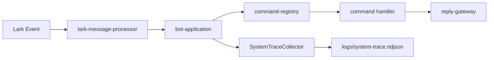

# 系统 Trace 日志方案

## 选择的方案

采用“可注入 trace collector + 本地 NDJSON 文件 sink”。相比直接在 `bot-application` 里写文件，这样可以让核心处理链路只产生日志记录，生产环境由文件适配器落盘，测试里用内存 collector 断言内容。

默认写入 `logs/system-trace.ndjson`，支持后续通过环境变量 `SYSTEM_TRACE_LOG_PATH` 覆盖。日志会记录完整输入与完整输出；因为包含原文内容，会同时把 `logs/` 加入 `.gitignore`，避免误提交运行时数据。

## 数据流



## 关键改动

- 在 `[src/ports/runtime.ts](src/ports/runtime.ts)` 增加 `SystemTraceCollector` 端口，定义 `record(trace)` 契约。
- 新增 `[src/system-trace.ts](src/system-trace.ts)`，包含 trace record 类型、步骤计时 helper、回复输出捕获 helper，以及 JSON 安全序列化。
- 在 `[src/app/bot-application.ts](src/app/bot-application.ts)` 的 `handleMessage` / `processMessage` 中收集单次消息 trace：
    - `input.text` 记录完整消息文本。
    - `steps` 记录 `dedup`、`reaction.add`、`command.resolve`、`command.execute`、`reply.send`、`reaction.remove` 等阶段的 `durationMs` 和 `elapsedMs`。
    - `output` 记录完整回复。流式回复通过包装 `AsyncIterable` 累积 chunk，在 `replies.send` 消费完成后写入完整输出。
    - `status` 覆盖 `success`、`duplicate_ignored`、`no_command`、`error`。
- 新增文件适配器，例如 `[src/adapters/file-system-trace.ts](src/adapters/file-system-trace.ts)`，负责创建目录并 append NDJSON；写入失败只记 error，不影响机器人回复。
- 在 `[src/config.ts](src/config.ts)` / `[src/default-config.ts](src/default-config.ts)` 加入 `systemTrace.logPath`，默认 `logs/system-trace.ndjson`，可由 `SYSTEM_TRACE_LOG_PATH` 覆盖。
- 在 `[src/lark-bot.ts](src/lark-bot.ts)` 创建文件 collector 并传给 `[src/lark-message-processor.ts](src/lark-message-processor.ts)`，再传给 bot application。
- 更新 `[.gitignore](.gitignore)` 忽略 `logs/`。如项目有 `.env.example` 或 README 中的环境变量说明，也补充 `SYSTEM_TRACE_LOG_PATH`。

## 日志格式

每行一条 JSON，便于 `rg`、日志采集器或脚本处理。示例字段：

```json
{
    "timestamp": "2026-06-09T07:30:00.000Z",
    "chatId": "chat_1",
    "messageId": "om_1",
    "input": { "text": "你好" },
    "output": { "type": "stream", "text": "收到" },
    "status": "success",
    "steps": [
        { "name": "reaction.add", "durationMs": 2, "elapsedMs": 2 },
        { "name": "command.resolve", "durationMs": 1, "elapsedMs": 3 },
        { "name": "command.execute", "durationMs": 1200, "elapsedMs": 1203 },
        { "name": "reply.send", "durationMs": 300, "elapsedMs": 1503 }
    ]
}
```

## 测试与验证

先按 TDD 增加失败测试，再实现：

- `[test/bot-application.test.ts](test/bot-application.test.ts)`：断言成功消息写出完整输入、完整输出和步骤耗时；断言重复消息也写 `duplicate_ignored`。
- `[test/bot-application.test.ts](test/bot-application.test.ts)` 或新增 `[test/system-trace.test.ts](test/system-trace.test.ts)`：覆盖流式回复输出捕获和 error 序列化。
- `[test/config.test.ts](test/config.test.ts)`：覆盖默认日志路径与 `SYSTEM_TRACE_LOG_PATH` 覆盖。
- 如新增文件 sink，使用临时目录测试 NDJSON append 和自动建目录。
- 最后运行 `pnpm test`、`pnpm typecheck`，提交前再运行 `pnpm format:check` 或 `pnpm format`。
