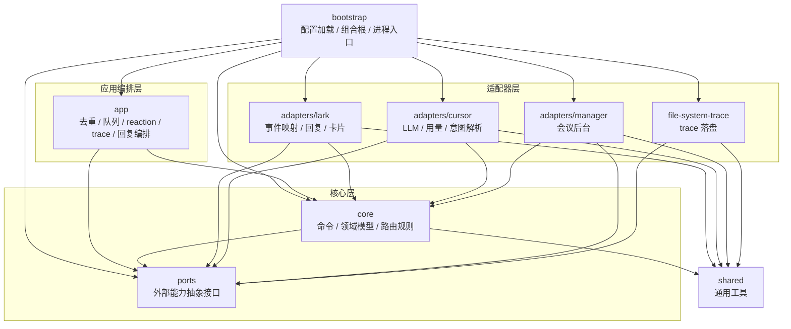
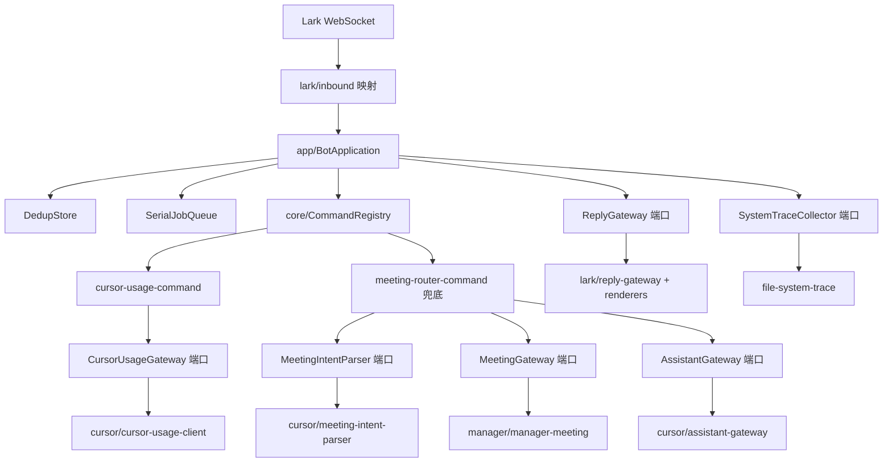
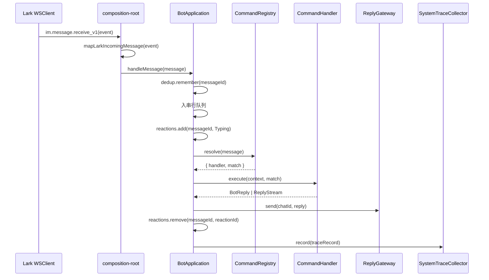

# 架构说明

`lark-cli` 是一个单进程、可扩展的 Lark 机器人框架：通过 Lark WebSocket 接收文本消息，经命令注册表路由到内置命令或经 LLM 意图路由兜底，再把回复（文本 / 交互卡片 / 流式卡片）发回同一会话。没有独立 HTTP 服务、数据库或多进程。

代码遵循「模块化单体 + 端口适配器（Ports & Adapters / Hexagonal）」：核心业务（`core`）只依赖抽象接口（`ports`），所有外部系统（Lark、Cursor、运营后台、文件系统）都在 `adapters` 中实现，由 `bootstrap` 统一装配。

## 目录结构

```text
src/
  index.ts                       # 极简入口：loadConfig() + startBot()
  bootstrap/                     # 装配层：配置加载 + 唯一组合根
    config.ts                    # 环境变量加载与校验
    default-config.ts            # 非敏感默认值
    composition-root.ts          # 唯一装配点（构建 Lark/Cursor/Manager 依赖并启动 WS）
  app/                           # 应用编排层
    bot-application.ts           # 去重 / 串行队列 / reaction / trace / 回复编排
    serial-job-queue.ts          # 串行任务队列
    in-memory-dedup-store.ts     # 消息去重存储
    weekly-report-job.ts         # 周报任务：读 NDJSON、生成复盘、私聊推送
    weekly-report-scheduler.ts   # 周五本地时刻调度（可配置 hour/minute）
  core/                          # 领域核心（不依赖任何 adapter）
    types.ts                     # MessageInput / BotReply / ReplyStream / CommandHandler
    command-registry.ts          # 命令注册表（按序匹配 + 兜底）
    reactions.ts                 # 默认 reaction emoji
    assistant-prompt.ts          # 助手回复 Prompt 构建
    meeting.ts                   # 会议领域类型与枚举标签
    cursor-usage.ts              # 用量领域类型与格式化
    system-trace.ts              # Trace 记录类型 / 计时 / 输出捕获 / 序列化
    weekly-commit-week.ts        # 周日至周六周界、YYYY-Month-Wn 文件名
    weekly-commit.ts             # NDJSON 解析 / 按项目分组 / Prompt 与空周文案
    commands/
      meeting-router-command.ts  # 兜底命令：LLM 意图路由（创建会议 or 助手）
      cursor-usage-command.ts    # 查询 token 用量命令
      cursor-usage-parser.ts     # 用量命令文本解析
  ports/                         # 端口（核心 / 应用依赖的抽象接口）
    reply.ts  assistant.ts  meeting.ts  cursor-usage.ts
    reaction.ts  trace.ts  runtime.ts   # runtime 仅 Logger/DedupStore/JobQueue
    weekly-commit-store.ts  weekly-report.ts
  adapters/                      # 适配器（端口的具体实现）
    lark/
      protocol.ts                # Lark 事件类型 + 内容/表情序列化
      inbound.ts                 # Lark event -> MessageInput（含 @ 提及剥离）
      gateways.ts                # Lark.Client -> reaction/消息/卡片底层操作
      reply-gateway.ts           # ReplyGateway：文本/卡片/流式回复
      renderers.ts               # 卡片与文本渲染
    cursor/
      cursor-agent.ts            # @cursor/sdk 加载 + streamCursorReply/askCursor
      assistant-gateway.ts       # AssistantGateway 实现
      meeting-intent-parser.ts   # MeetingIntentParser 实现（含参数归一化）
      cursor-usage-client.ts     # CursorUsageGateway 实现
    manager/
      manager-meeting.ts         # MeetingGateway 实现（登录/token/会议/云播）
    file-system-trace.ts         # SystemTraceCollector 实现（NDJSON 落盘）
    file-system-weekly-commit-store.ts  # WeeklyCommitStore（只读 weekly-commits）
    ai-weekly-report-generator.ts       # WeeklyReportGenerator（AI 复盘文本）
  shared/
    timing.ts                    # 无业务依赖的计时工具
```

## 分层依赖

依赖方向单向收敛：`bootstrap` 只负责装配，`app` 编排核心能力，`core` 只依赖领域模型与端口抽象，`adapters` 只作为端口实现接入外部系统。图中箭头表示源码依赖 / 调用方向，`core` 不依赖任何 adapter。



## 运行时数据流



## 消息处理时序



去重、队列等待、reaction、命令解析、命令执行、回复发送、reaction 移除都会被 `core/system-trace` 记录为带耗时的步骤；最终 trace 由 `file-system-trace` 以 NDJSON 形式按天落盘。重复消息只记录一条 `duplicate_ignored` trace，不会重复回复。

## 命令路由

`CommandRegistry` 按注册顺序逐个调用 `handler.match(message)`，命中即返回；都未命中再尝试兜底 handler。当前装配为：

- 显式命令：`cursor-usage-command`（匹配「cursor …」）。
- 兜底：`meeting-router-command`。它调用 `MeetingIntentParser`（Cursor）对消息做意图判定：
    - `create_meeting`：归一化参数后调用 `MeetingGateway`（运营后台）创建会议 / 云播，返回 `meeting_created` / `meeting_failed`。
    - 其它（含解析失败）：调用 `AssistantGateway`（Cursor）以流式文本兜底回复。

## 扩展指南

### 新增一个命令

1. 在 `core/commands/` 新增 `CommandHandler`（实现 `name` / `match` / `execute`）。若需要外部能力，定义/复用 `ports/` 中的端口，不要在 `core` 直接 import adapter。
2. 如需新外部能力，在 `adapters/` 下实现对应端口（见下）。
3. 在 `bootstrap/composition-root.ts` 构造依赖，并把 handler 注册进 `createCommandRegistry([...显式命令], 兜底)`。显式命令放数组、需要兜底的放第二个参数。
4. 在 `test/command-handlers.test.ts` 用 fake 端口补单测；涉及用户可见能力时同步更新 `usage.md`。

### 新增一个适配器（实现某端口）

1. 在 `ports/` 中确认/新增端口类型（核心只认接口）。
2. 在 `adapters/<system>/` 实现 `createXxxGateway(config)` 返回该端口，配置类型由适配器自带，不反向依赖 `bootstrap`。
3. 在 `bootstrap/config.ts` 增加所需配置字段（敏感值读环境变量，非敏感默认值放 `default-config.ts`）。
4. 在 `composition-root.ts` 装配并注入到需要它的命令 / 应用。
5. 为适配器补单测（注入 fake `fetch` 或 fake SDK）。

## 测试组织

测试位于 `test/`，按分层与适配器划分：`bot-application`（编排）、`command-handlers` / `command-registry`（核心命令）、`meeting-intent-parser` / `cursor-usage` / `cursor-agent`（cursor 适配器）、`manager-meeting`（运营后台适配器）、`lark-adapter`（inbound / protocol / renderers / reply-gateway）、`file-system-trace`（trace 落盘）、`weekly-commit` / `weekly-report-job` / `weekly-report-scheduler`（周报）、`config`、`timing`、`assistant-prompt`。单测全部使用 fake 端口 / fake `fetch`，无需真实凭证。
